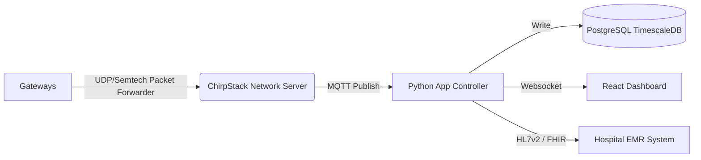

# Software & Backend Design

## 1. High-Level Architecture
The software backend transforms raw LoRaWAN packets into actionable medical insights. It is designed to be **containerized (Docker)** for easy on-premise hospital deployment.



## 2. Components

### A. LoRaWAN Network Server (LNS)
*   **Choice:** **ChirpStack** (Open Source).
*   **Role:** Manages gateways, authenticates devices (Join Request), decrypts payloads, handles downlink queue.
*   **Integration:** Publishes decrypted events to MQTT topic `application/ID/device/EUI/event/up`.

### B. Application Controller (The "Brain")
*   **Language:** Python (FastAPI or Django) or Node.js.
*   **Functions:**
    *   **MQTT Client:** Subscribes to ChirpStack data.
    *   **Payload Decoder:** Unpacks the 6-byte binary payload into JSON (e.g., `{"volume": 1200, "flow": 50, "alarm": false}`).
    *   **Logic Engine:** 
        *   *Alerts:* If `volume > 1800` -> Send Notification.
        *   *Analytics:* Calculate shift totals (7am-7pm).
    *   **API:** REST API for the frontend to fetch bed status.

### C. Database
*   **Primary:** **PostgreSQL** with **TimescaleDB** extension.
*   **Why:** Medical data is time-series. We need efficient storage of volume readings every hour/minute for history graphs.
*   **Schema Example:**
    ```sql
    TABLE measurements (
        time        TIMESTAMPTZ NOT NULL,
        device_eui  VARCHAR(16),
        patient_id  VARCHAR(50),
        volume_ml   INT,
        flow_rate   INT,
        battery_pct INT
    );
    ```

### D. Frontend Dashboard
*   **Framework:** **React.js** or **Vue.js**.
*   **Views:**
    *   **Ward Map:** Grid view of beds with color codes (Green=OK, Red=Full/Blocked, Yellow=Low Battery).
    *   **Patient Detail:** Line graph of urine output over the last 24h.
    *   **Settings:** "Tare" button (sends LoRaWAN downlink to device), Alarm thresholds.

## 3. Integration with Hospital Systems (EMR)
Hospitals use legacy systems. We need an **Integration Engine**.
*   **Protocol:** **HL7 v2.x** (Most common) or **FHIR** (Modern).
*   **Workflow:**
    1.  Nurse scans Patient Wristband + Device QR code.
    2.  App Server links `Device_A` to `Patient_123`.
    3.  Every hour, App Server generates an **ORU^R01** (Observation Result) HL7 message.
    4.  Sends to Hospital Interface Engine (Mirth Connect / Iguana).

## 4. Deployment Stack (Docker Compose)
```yaml
version: '3'
services:
  chirpstack:
    image: chirpstack/chirpstack:4
    ports: ["8080:8080"]
  
  postgres:
    image: timescale/timescaledb:latest-pg14
    
  app-server:
    build: ./backend
    command: python main.py
    
  frontend:
    build: ./frontend
    ports: ["3000:80"]
```
