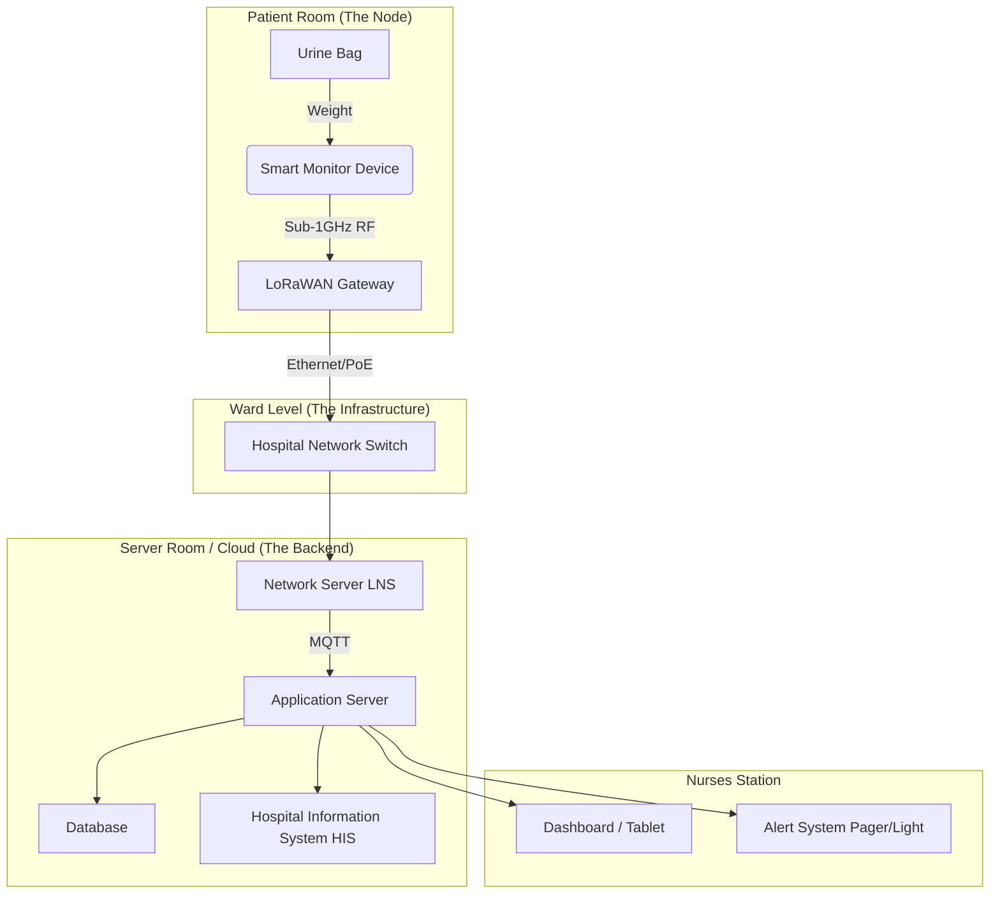

# System Architecture Design
## Intelligent Hospital Urine Bag Monitoring System

### 1. High-Level Topology
The system follows a **Star-of-Stars** topology typical of LoRaWAN networks. It is designed for high density, deep indoor penetration, and low power consumption.

### 2. Data Flow Architecture

1.  **Sensing Layer (Edge):**
    *   **Input:** Physical weight of urine bag.
    *   **Processing:** ADC conversion (HX711), artifact filtering (removing motion noise), formatting payload.
    *   **Output:** Encrypted LoRaWAN packet (Payload: `Volume_mL`, `Battery_%`, `Status_Flags`).

2.  **Transport Layer:**
    *   **Protocol:** LoRaWAN 1.0.3 or 1.1 (Class A devices).
    *   **Frequency:** Region specific (e.g., US915, EU868).
    *   **Gateway Connectivity Models (Select based on Hospital Infrastructure):**
        *   **Option 1: PoE Line (Preferred):**
            *   **Data:** Ethernet.
            *   **Power:** 802.3af/at PoE from Switch or Injector.
            *   **Pros:** Single cable, high reliability, no separate power supply needed.
        *   **Option 2: Wi-Fi Line:**
            *   **Data:** Wi-Fi (WPA2/WPA3 Enterprise).
            *   **Power:** 12V DC Adapter or USB-C.
            *   **Pros:** Flexible placement where Ethernet drops are missing.
    *   **Gateway Hardware:** **RAK7268V2** (Supports both Ethernet/PoE and Wi-Fi/DC out of the box).

3.  **Network Layer (LNS):**
    *   **Software:** ChirpStack (Self-hosted for privacy) or The Things Stack Enterprise.
    *   **Functions:** Deduplication (if multiple gateways hear a node), Authentication (OTAA), Decryption (AppSKey), Data forwarding via MQTT/Webhooks.

4.  **Application Layer:**
    *   **Business Logic:**
        *   Decodes binary payload.
        *   Calculates urine flow rate (mL/hour).
        *   Checks thresholds (Full > 80%, Flow < 10mL/h for 2 hours).
        *   Manages patient-to-device mapping.
    *   **Storage:** Time-series database (InfluxDB) for sensor data; Relational DB (PostgreSQL) for patient/device management.

### 3. Security Architecture
Given the medical context (HIPAA/GDPR considerations), security is paramount, even though the raw data (weight) is not PII until associated with a patient record.

*   **Device Level:** 
    *   **AES-128 Encryption:** Native to LoRaWAN (NwkSKey for network, AppSKey for payload).
    *   **Hardened Firmware:** Read-out protection enabled on STM32 to prevent cloning.
*   **Key Management & Provisioning:**
    *   **OTAA (Over-the-Air Activation):** Devices are provisioned with a unique `DevEUI`, `JoinEUI` (AppEUI), and `AppKey` at the factory.
    *   **Ownership:** The Hospital IT department (or the Service Provider) owns the **Join Server**. Keys are not shared with third-party network operators if using a private ChirpStack instance.
    *   **Lifecycle:** Keys are rotated only upon device reset/re-join. Compromised devices can be blacklisted by `DevEUI` in the LNS.
*   **Network Level:**
    *   **Private Deployment:** Gateways point to a local IP, keeping data within the hospital intranet.
    *   **TLS/SSL:** All traffic from Gateway to Server and Server to UI is encrypted.
*   **Application Level:**
    *   **Role-Based Access Control (RBAC):** Nurses view ward status; Admins manage devices.
    *   **Audit Logs:** Track who acknowledged alarms.

### 4. Scalability Strategy
*   **Ward-by-Ward:** Each ward is a logical "Application" in the LNS.
*   **Capacity:** A single backend server (Dockerized) can handle 10,000+ devices.
*   **Redundancy:** Deploy 2 gateways per critical floor for overlapping coverage.

### 5. Network Health & Reliability (Gateway: RAK7268V2)
To ensure system uptime in a critical hospital environment, the following reliability features are enabled:

*   **Gateway Self-Healing (Ping Watchdog):**
    *   **Mechanism:** The RAK7268V2 "Ping Watchdog" feature periodically pings a known reliable IP (e.g., LNS or 8.8.8.8).
    *   **Action:** If connectivity fails for a set duration, the gateway automatically reboots to clear potential firmware/modem hangs.
*   **Uplink Failover (Backhaul Redundancy):**
    *   **Primary:** Ethernet (PoE) / Wi-Fi.
    *   **Backup:** LTE Cat 4 (via RAK7268CV2 variant) if the hospital network goes down.
    *   **Configuration:** "Uplink Backup" mode is enabled in WisGateOS 2.
*   **Data Buffering:**
    *   **Local Storage:** The gateway buffers LoRaWAN packets in its "Packet Forwarder" buffer (SD card backed) if the backhaul is temporarily unavailable, preventing data loss during short outages.
*   **LNS Monitoring:**
    *   **Keep-Alives:** The LNS tracks the gateway's "last seen" status (via UDP Keep-Alives or MQTT Pings).
    *   **Alerting:** If a gateway is offline for >5 minutes, the Application Server triggers an alert to the IT maintenance team.
